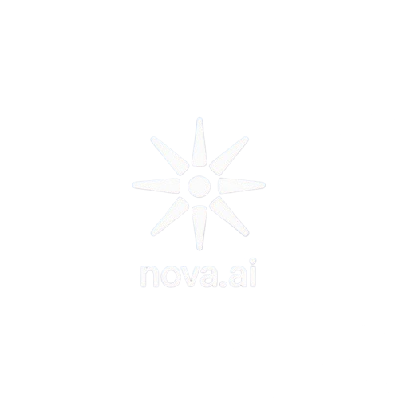

# Nova  [](https://nova-new.vercel.app/)

Welcome to **Nova** — your next-generation AI chat companion. Nova is a beautifully designed, full-stack conversational AI platform inspired by ChatGPT, built for seamless productivity, creativity, and collaboration. Whether you're a developer, student, or enthusiast, Nova empowers you to interact with advanced language models in a secure, modern, and delightful environment.

---

## 🌐 Routes

- Main App: [https://nova-new.vercel.app/](https://nova-new.vercel.app/)
- Chat Route: [https://nova-new.vercel.app/chat/user/chatid](https://nova-new.vercel.app/chat/user/chatid)

---

## 🧩 Tech Stack

Nova is built with a modern, robust technology stack:

- **Frontend & Framework**: [Next.js](https://nextjs.org/) (App Router), [React 19](https://react.dev/)
- **Styling**: [Tailwind CSS](https://tailwindcss.com/), [styled-components](https://styled-components.com/)
- **Authentication**: [Clerk](https://clerk.com/)
- **Database & Backend**: [Supabase](https://supabase.com/)
- **AI/LLM APIs**: [Google Gemini](https://ai.google.dev/gemini-api), [OpenRouter](https://openrouter.ai/), [Groq](https://groq.com/)
- **Payments**: [Razorpay](https://razorpay.com/)
- **UI/UX Enhancements**: [Lucide Icons](https://lucide.dev/), [Tabler Icons](https://tabler.io/icons), [COBE Globe](https://github.com/shuding/cobe), [Motion One](https://motion.dev/)
- **Utilities**: [clsx](https://github.com/lukeed/clsx), [shiki](https://shiki.matsu.io/), [dotted-map](https://github.com/evansiroky/dotted-map)
- **TypeScript** for type safety

---

## 🚀 Key Features

- **Multi-Model AI Chat**: Converse with state-of-the-art LLMs including Gemini, OpenRouter, and Groq.
- **Secure Authentication**: Effortless sign-in and user management powered by Clerk.
- **Personalized Chat History**: Your conversations are organized and accessible, tailored to each user.
- **Immersive UI**: Enjoy a stunning interface with animated globe and star backgrounds, responsive layouts, and smooth transitions.
- **Modern Tech Stack**: Built with Next.js, React 19, Tailwind CSS, and styled-components for top-tier performance and aesthetics.
- **Premium Upgrades**: Unlock advanced features and priority access with a secure Razorpay-powered Plus plan.
- **Social & Portfolio Integration**: Quick links to your portfolio and social profiles for easy networking.

---

## 🌟 Live Demo



---

## 🛠️ Getting Started

Follow these steps to set up Nova locally:

### 1. Clone the Repository

```bash
git clone https://github.com/bhargav-patel-07/nova.git
cd nova
```

### 2. Install Dependencies

```bash
npm install
```

### 3. Configure Environment Variables

Create a `.env.local` file in the `nova` directory and add the following:

```env
# Clerk (Authentication)
NEXT_PUBLIC_CLERK_PUBLISHABLE_KEY=your_clerk_publishable_key
CLERK_SECRET_KEY=your_clerk_secret_key

# Supabase (Database)
NEXT_PUBLIC_SUPABASE_URL=your_supabase_url
NEXT_PUBLIC_SUPABASE_ANON_KEY=your_supabase_anon_key

# LLM APIs
GEMINI_API_KEY=your_gemini_api_key
GROQ_API_KEY=your_groq_api_key
OPENROUTER_API_KEY=your_openrouter_api_key

# Razorpay (Plus Plan)
NEXT_PUBLIC_RAZORPAY_KEY_ID=your_razorpay_key_id
```

> **Note:** Only the variables for the services you intend to use are required, but providing all is recommended for full functionality.

### 4. Start the Development Server

```bash
npm run dev
```

- Visit the main app: [http://localhost:3000](http://localhost:3000)
- Access chat directly: [http://localhost:3000/chat/user/chatid](http://localhost:3000/chat/user/chatid)

---

## 🗂️ Project Structure

- `src/app/` — Next.js app directory (routing, pages, API endpoints)
- `src/components/` — Modular UI components (chat, sidebar, globe, etc.)
- `src/utils/` — Utility functions (API handlers, Supabase client, etc.)
- `public/` — Static assets (logos, images)

---

## 📦 Available Scripts

- `npm run dev` — Launches the development server
- `npm run build` — Builds the app for production
- `npm run start` — Starts the production server

---

## 🤝 Credits & Acknowledgements

Nova is built with the help of these amazing technologies:

- [Next.js](https://nextjs.org/)
- [React](https://react.dev/)
- [Clerk](https://clerk.com/)
- [Supabase](https://supabase.com/)
- [Google Gemini](https://ai.google.dev/gemini-api)
- [OpenRouter](https://openrouter.ai/)
- [Groq](https://groq.com/)
- [Tailwind CSS](https://tailwindcss.com/)
- [Razorpay](https://razorpay.com/)

---

## 💡 Get Involved

Have ideas, feedback, or want to contribute? Feel free to open an issue or pull request. Nova is open to collaboration and improvement!

---

Made with ❤️ by [Bhargav Patel](https://bhargavpatel.vercel.app/)
